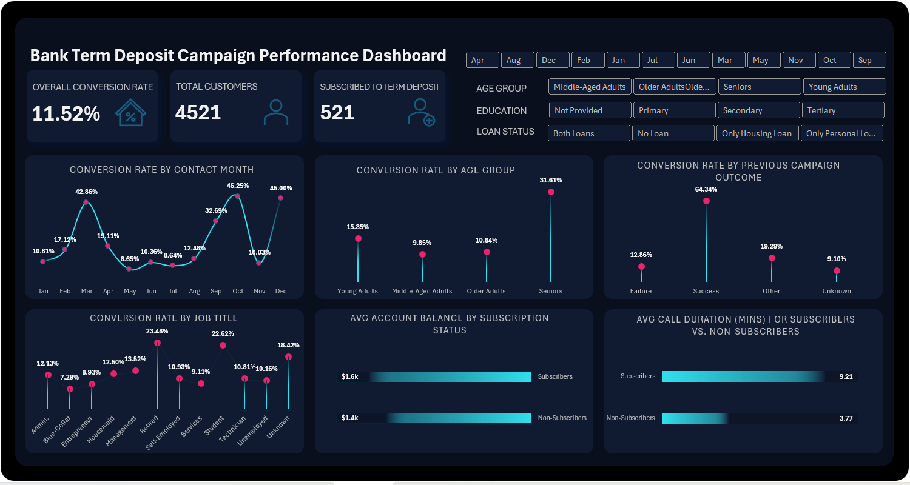
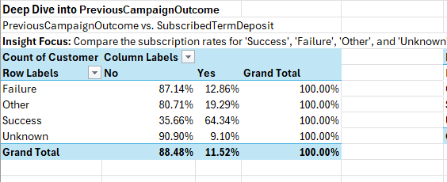
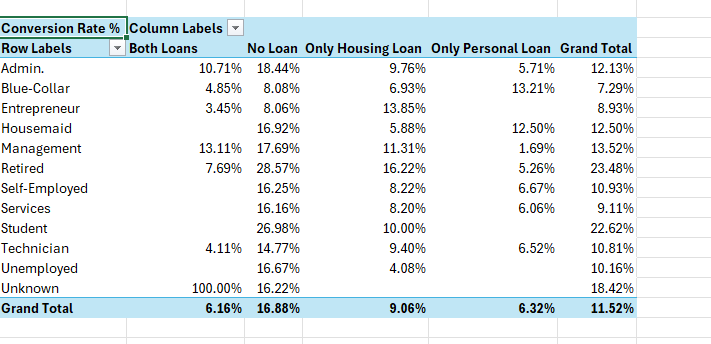
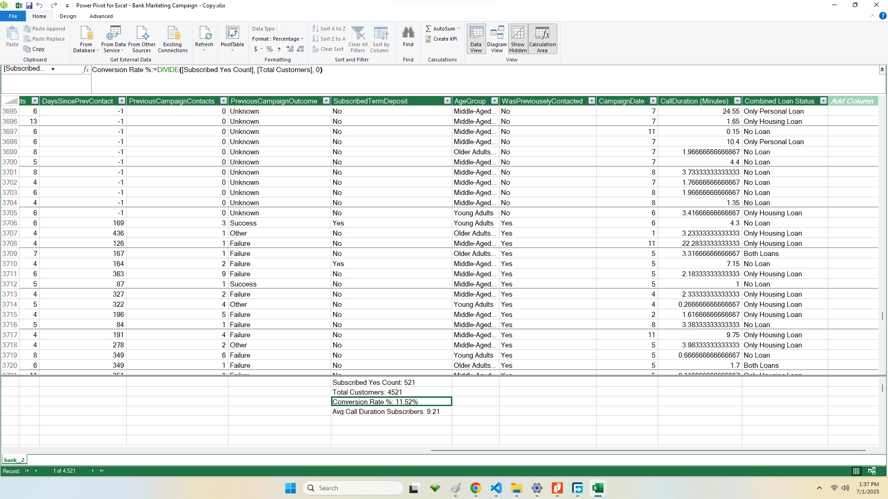

# Bank Marketing Campaign Analysis for Term Deposit Subscription

## Project Overview

This project analyzes a dataset from a direct marketing campaign conducted by a Portuguese banking institution. The campaign involved outreach via phone calls, aiming to encourage customers to subscribe to a term deposit. The primary goal of this analysis is to identify key factors influencing subscription success and provide actionable insights to optimize future marketing strategies.

**Dashboard/Report :** 

## Table of Contents

* [Business Problem](#business-problem)
* [Data Source](#data-source)
* [Methodology](#methodology)
    * [Data Import & Cleaning](#data-import--cleaning)
    * [Exploratory Data Analysis (EDA)](#exploratory-data-analysis-eda)
    * [Feature Engineering](#feature-engineering)
    * [Visualization](#visualization)
* [Key Questions Addressed](#key-questions-addressed)
* [Key Findings & Insights](#key-findings--insights)
* [Visualizations Showcase](#visualizations-showcase)
* [Actionable Recommendations](#actionable-recommendations)
* [Tools & Technologies](#tools--technologies)
* [Project Structure](#project-structure)
* [How to Use/Reproduce](#how-to-usereproduce)
* [Future Work](#future-work)
* [Author](#author)
* [Acknowledgments](#acknowledgments)

## Business Problem

The banking institution aims to improve the efficiency and effectiveness of its direct marketing campaigns for term deposits. Key business objectives include:
* Increasing the overall subscription rate for term deposits.
* Identifying customer segments with a higher propensity to subscribe.
* Optimizing campaign outreach strategies (e.g., contact timing, channels).
* Understanding the impact of customer demographics and financial profiles on subscription decisions.

This analysis seeks to provide data-driven answers to inform these objectives.

## Data Source

The dataset used for this analysis is the "Bank Marketing Data Set" from InternPulse. It contains information on **4521** instances (customer contacts) with **23** attributes, including customer demographics, last contact information, and previous campaign outcomes.

* **Target Variable:** `SubscribedTermDeposit` - Has the client subscribed a term deposit? (Yes/No)

## Methodology

### Data Import & Cleaning

* The raw data (CSV format) was imported into Excel using Power Query.
* Initial data inspection was performed to understand data types, structure, and potential issues.
* **Cleaning steps included:**
    * No missing values were identified, simplifying the cleaning process.
    * Standardizing categorical data (e.g., ensuring consistent capitalization where needed).
    * Correcting data types (e.g., ensuring numerical fields were numeric, text fields were text).
    * Renaming columns for clarity (e.g., `y` to `SubscribedTermDeposit`, `pdays` to `DaysSincePrevContact`).

### Exploratory Data Analysis (EDA)

Descriptive statistics and visualizations were used to understand the distribution of individual variables and their relationships with the target variable (`SubscribedTermDeposit`).
* Analyzed the overall subscription rate.
* Examined distributions of numeric features (`Age`, `AccountBalance`, `CallDuration (Seconds)`, `CampaignContacts`, `DaysSincePrevContact`, `PreviousCampaignContacts`) using summary statistics.
* Investigated frequency distributions of categorical features (`Job Title`, `MaritalStatus`, `EducationLevel`, `HasCreditDefault`, `HasHousingLoan`, `HasPersonalLoan`, `ContactMethod`, `ContactMonth`, `PreviousCampaignOutcome`, `AgeGroup`, `WasPreviouselyContacted`, `Combined Loan Status`).
* Bivariate analysis was conducted to assess the impact of each feature on subscription rates using PivotTables and appropriate charts, focusing on conversion percentages.

### Feature Engineering

New features were created to enhance the analysis and derive deeper insights using Power Query:
* `AgeGroup`: Categorizing customers into age brackets for easier segmentation.
* `WasPreviouslyContacted`: Binary flag based on `DaysSincePrevContact` (identifying if a client was previously contacted or not).
* `CallDuration (Minutes)`: Converting `CallDuration (Seconds)` to minutes for more intuitive analysis.
* `Combined Loan Status`: Categorizing customers based on their `HasHousingLoan` and `HasPersonalLoan` status ('No Loan', 'Only Housing Loan', 'Only Personal Loan', 'Both Loans').

### Visualization

Microsoft Excel charts were used to create a dashboard/set of visualizations to communicate findings effectively. Key charts include:
* Bar charts for comparing subscription rates across categorical segments (e.g., `AgeGroup`, `Job Title`, `EducationLevel`, `ContactMethod`, `PreviousCampaignOutcome`).
* Column charts for comparing average numerical metrics (e.g., `Average AccountBalance`, `Average CallDuration (Minutes)`) between subscribers and non-subscribers.
* The dashboard incorporates interactive slicers to allow dynamic filtering and exploration of the data.

## Key Questions Addressed

This analysis aimed to answer the following stakeholder-relevant questions:
1.  Which customer segments are most receptive to our term deposit offers, and how can we better target them?
2.  How effective was our previous campaign engagement in driving current subscriptions, and what's the optimal timing to re-engage past customers?
3.  Are our current campaign outreach strategies efficient? Which channels and contact frequencies yield the best results?
4.  Does a customer's existing financial relationship with us significantly impact their likelihood to subscribe?
5.  What is the overall success of this marketing campaign, and what are key indicators of engaged customers?

## Key Findings & Insights

* **Overall Subscription Rate:** The campaign achieved an overall subscription rate of **8.75%**.
* **Previous Success is Key:** Customers with a previous successful campaign outcome (`PreviousCampaignOutcome` = 'Success') exhibit a remarkably high subscription rate of **64.34%**, significantly outperforming all other groups.
* **Re-engagement Pays Off:** Previously contacted customers (`WasPreviouslyContacted` = 'Yes') subscribe at **22.55%**, which is more than double the rate of **9.10%** for those not previously contacted (`WasPreviouslyContacted` = 'No'). The analysis suggests that the optimal re-contact window for non-successful previous contacts appears to be within 91-180 days post-last contact.
* **Target Demographics:**
    * `Retired` individuals show the highest subscription rates by job.
    * Customers with `Tertiary` education are more likely to subscribe.
    * `Single` and `Divorced` individuals have higher subscription rates than `Married` individuals.
* **Financial Profile:**
    * Customers with `No Loan` obligations (`Combined Loan Status` = 'No Loan') subscribe at a higher rate (**16.8%**) compared to those with existing loans.
    * Surprisingly, customers with lower `AccountBalance` (e.g., below €10,000) showed a higher propensity to subscribe.
* **Campaign Mechanics:**
    * `Cellular` contact is the most effective channel for outreach.
    * Longer `CallDuration (Minutes)` are strongly correlated with subscription success (average of **9.21 minutes** for subscribers vs. **3.77 minutes** for non-subscribers). This indicates that more engaged and detailed conversations lead to better outcomes.
    * Subscription rates peak in **October** and are lowest in **December**, suggesting seasonal effectiveness.
* **Low Impact Factor:** `HasCreditDefault` status showed minimal difference in subscription rates, indicating it may not be a strong differentiator for this product.

## Visualizations Showcase
* A bar chart showing the dramatic difference in subscription rates by `PreviousCampaignOutcome`.
 
    
  
* A bar chart highlighting subscription rates by `Job Title` or `Combined Loan Status`.
 
    
* 

## Actionable Recommendations

Based on the analysis, the following recommendations are proposed to the banking institution:
1.  **Prioritize Previously Successful Customers:** Dedicate significant resources to re-engage customers with a previous 'success' outcome, as they represent the highest conversion potential. Implement a dedicated re-engagement strategy for this group.
2.  **Optimize Re-contact Strategy:** Develop a structured re-contact schedule for previously contacted customers (especially those with 'Failure' or 'Other' outcomes) within the 91-180 day window to maximize conversion chances.
3.  **Refine Target Segmentation:** Focus marketing efforts on:
    * **Demographic segments:** `Retired` individuals, those with `Tertiary` education, and `Single`/`Divorced` marital statuses.
    * **Financial segments:** Customers with `No Loan` obligations and consider tailored messaging for those with lower account balances.
4.  **Enhance Channel & Call Strategy:**
    * Maximize the use of `Cellular` for outreach, as it proves to be the most effective contact method.
    * Train agents on effective engagement techniques to foster longer, quality conversations, understanding that call duration is a strong indicator of interest and a predictor of success. The goal should be quality engagement, not just extending calls for the sake of it.
5.  **Strategic Campaign Timing:** Plan major campaign pushes to capitalize on higher response months (like October) and consider alternative strategies or offers for lower response months (like December) to maintain engagement.
6.  **De-prioritize Non-Differentiating Factors:** Since credit default status showed minimal impact, resources allocated to segmenting or tailoring messages based on this factor can be re-directed to more impactful areas.

## Tools & Technologies

* **Data Cleaning & Transformation:** Microsoft Excel (Power Query)
* **Data Analysis:** Microsoft Excel (PivotTables, Power Pivot, DAX Formulas)
* **Data Visualization:** Microsoft Excel (Charts, Slicers)
* **Version Control:** Git, GitHub
* **Project Management:** Slack


## How to Use/Reproduce

To reproduce this analysis and explore the dashboard:

1.  **Clone the Repository:**
    ```bash
    git clone [Your GitHub Repo URL]
    ```
2.  **Download the Dataset:** Ensure the `Bank Marketing Campaign.csv` file is present in the cloned directory.
3.  **Open in Microsoft Excel:** Open the `Bank Term Deposit Dashboard.xlsx` file.
4.  **Refresh Data:** If prompted, refresh the data connections to ensure all Power Query transformations and Data Model calculations are up-to-date.
5.  **Explore the Dashboard:** Navigate to the "Dashboard" sheet (or equivalent) to interact with the slicers and view the insights. You can also explore the underlying Pivot Tables and Power Query steps.

## Future Work

* **Predictive Modeling:** Implement machine learning models (e.g., Logistic Regression) in Python or R to predict subscription likelihood for new customers, providing a predictive score.
* **Advanced Segmentation:** Utilize clustering algorithms (e.g., K-Means) to identify new, data-driven customer segments beyond the predefined ones.
* **Automated Reporting:** Integrate with VBA or Python scripting to automate report generation and distribution, potentially sending personalized summaries.
* **Web-Based Interface:** Develop a dynamic web application (e.g., using React/HTML/Python Flask) to host the dashboard, allowing broader access and potentially integrating the Gemini API for natural language querying of insights or personalized recommendations for marketing teams.
* **A/B Testing Integration:** Design and analyze A/B tests for different campaign strategies based on the insights gained.

## Author

Nelson M.

## Acknowledgments

* **InternPulse:** For providing the dataset.
